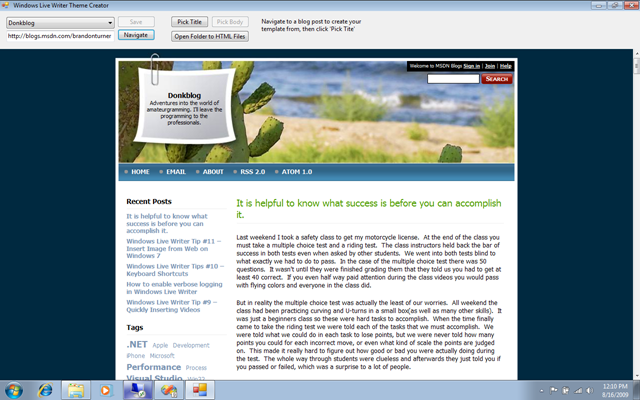
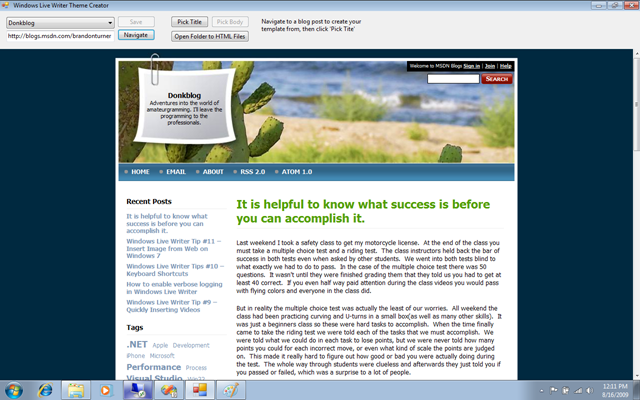
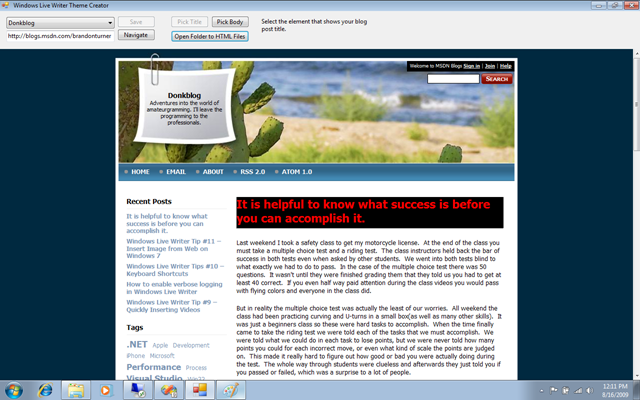
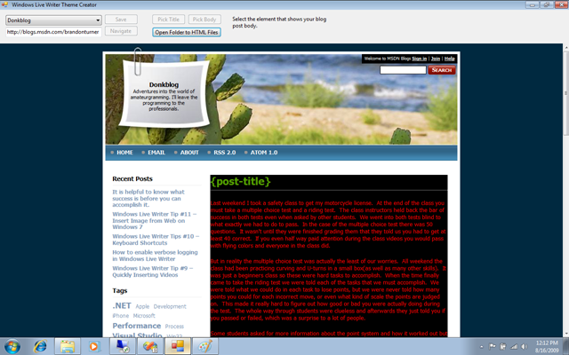
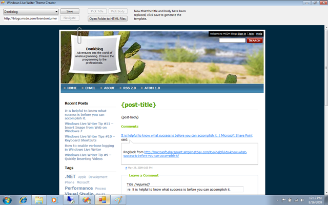

# ThemeFixer for Open Live Writer
> Theme Fixer is a utility to help troubleshoot theme detection issues with Open Live Writer

One of the nice things about Windows Live Writer is that lets you edit your blog in the same style your readers will actually see.  However, often times, Windows Live Writer cannot detect a blog theme or it incorrectly detects a user’s theme.  These problems can make users angry, and rightfully so.

If you have fallen victim to this problem, I have good news for you!

[Brandon Turner](https://blogs.msdn.microsoft.com/brandonturner/2009/08/16/broken-theme-in-windows-live-writer-you-can-fix-it/) created a tiny application to help you create a theme file for Writer. 

Download the Windows Live Writer Theme Fixer

### Step 1: Open the ThemeFixer.exe and select the blog you want to fix in the top left corner. 

### Step 2: Navigate to a single blog post on your blog by clicking a link or entering a URL in the textbox and clicking ‘navigate’.

### Step 3: Click ‘pick title’ and hover your mouse over the title of your blog post.  When you see the element selected, click on it.

### Step 4: Click ‘pick body’ and hover over the body of your post, make sure all of your post is highlighted.  Your post title might also be in the selected range, that is fine.

### Step 5: Click ‘save’ button and wait while it downloads all the html and images for your template.

If you still have problems after using this application, you can click the ‘Open template folder’ button where you can edit the HTML file yourself
